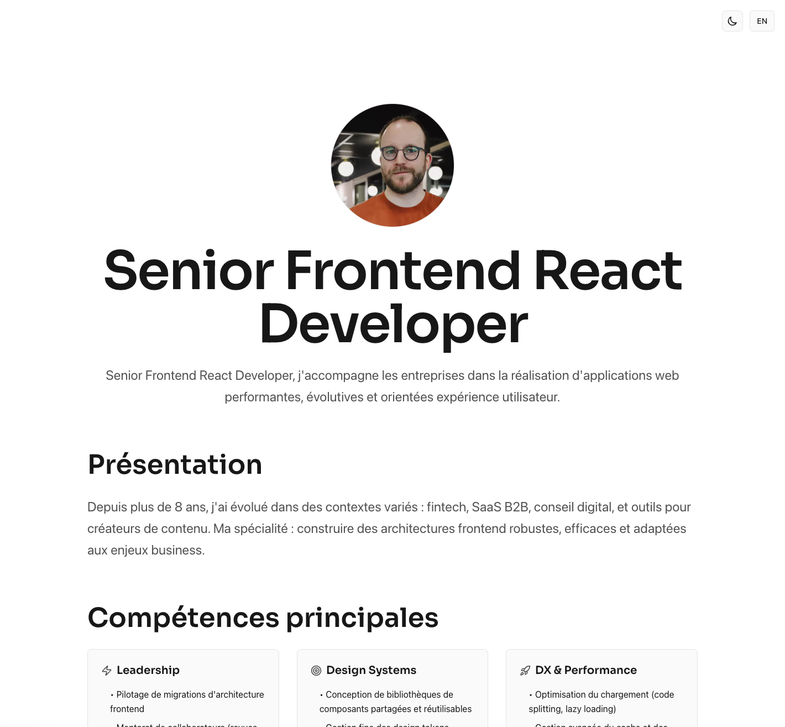
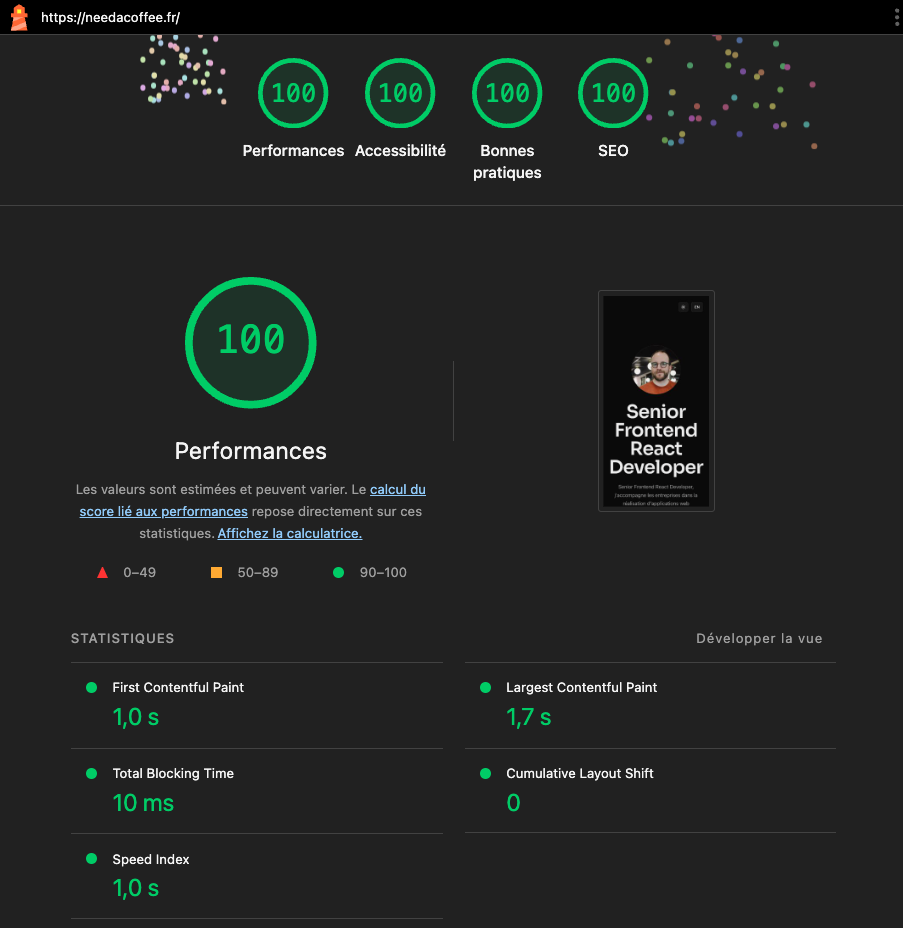

## needacoffee.fr

Personal site and portfolio for Thomas Alberola.



### Tech

- Next.js App Router (React + TypeScript)
- Tailwind CSS v4
- Lucide icons
- Simple i18n via `lib/i18n-app.ts` with JSON dictionaries in `locales/`

### Local development

```bash
npm install
npm run dev
```

### Scripts

- `npm run dev`: start dev server
- `npm run build`: production build
- `npm run start`: start production server
- `npm run type-check`: TypeScript check
- `npm run lint`: ESLint
- `npm run format`: Biome format write

### Internationalization

- Default locale: `fr` at `/`
- English: `en` at `/en`
- Keys live in `locales/fr.json` and `locales/en.json`

### Downloads

- CV FR: `public/files/Thomas_Alberola_CV_FR.pdf`
- CV EN: `public/files/Thomas_Alberola_CV _EN.pdf`
- Anonymous skills dossier (FR only): `public/files/Dossier de compétence Anonyme - Senior frontend.pdf`

### Deployment

Deployed on Vercel. No CI in-repo; checks run on Vercel.

### License

MIT — see `LICENSE`.

### Lighthouse


